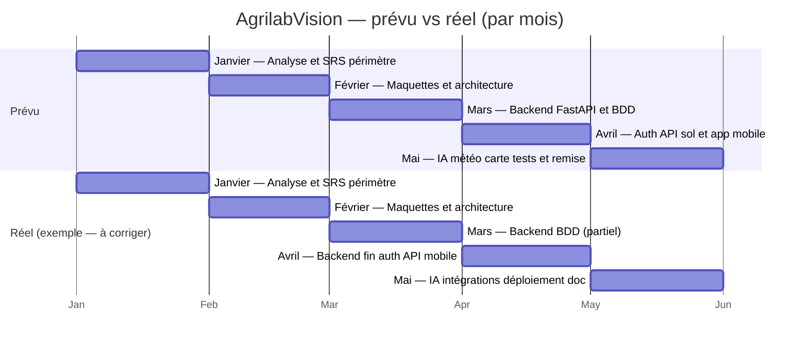

# AgrilabVision — Gantt prévu vs réel (granularité : **mois uniquement**)

Les barres correspondent chacune à **un mois civil** (janvier → mai 2026). Aucun jour n’apparaît dans les libellés ; l’axe du diagramme affiche seulement le **mois** (`%b`). Les dates en `YYYY-MM-DD` ci-dessous servent uniquement de repère technique pour Mermaid (toujours le **1er du mois**).

**À adapter :** modifie les libellés et, si besoin, décale une tâche d’un mois en changeant `2026-MM-01` et la durée du mois (`31d`, `28d`, `31d`, `30d`, `31d` pour jan–mai 2026).

## Diagramme (Mermaid)

## Légende rapide

| Phase (mois) | Contenu (code) |
|--------------|----------------|
| Backend | `backend/app/main.py`, SQLAlchemy |
| Auth | `backend/app/auth.py` |
| Mobile | `frontend/mobile/` |
| IA / météo | `app/ai.py`, `integrations.py` |
| Déploiement | `render.yaml`, Render |

## Tableau mois uniquement (source)

Voir [`gantt_planned_vs_actual.csv`](gantt_planned_vs_actual.csv) : colonnes **Mois_prévu** et **Mois_réel** sans jour.
